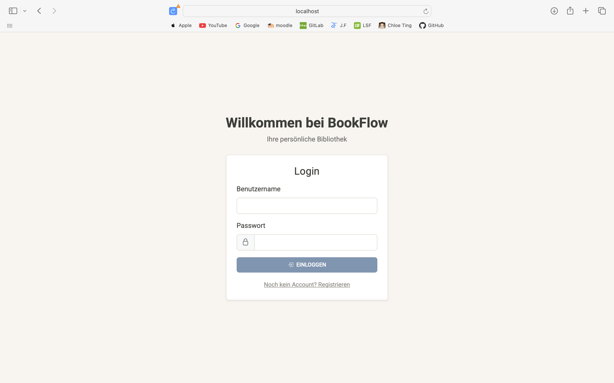
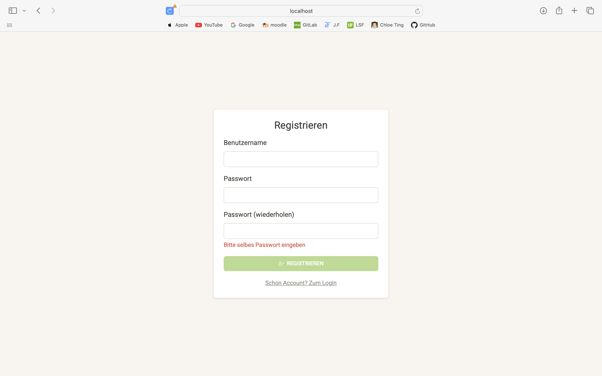
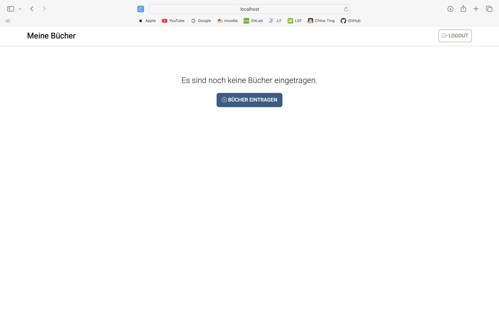
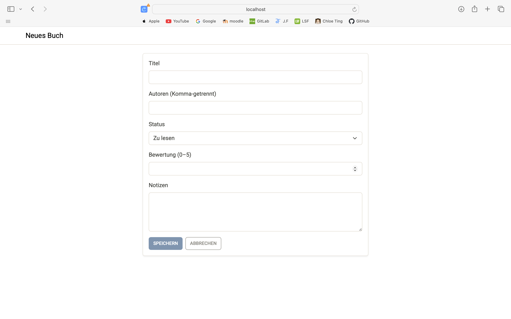
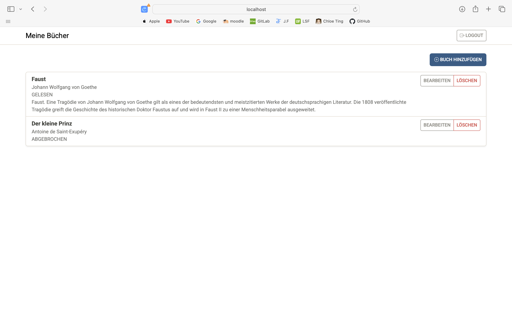
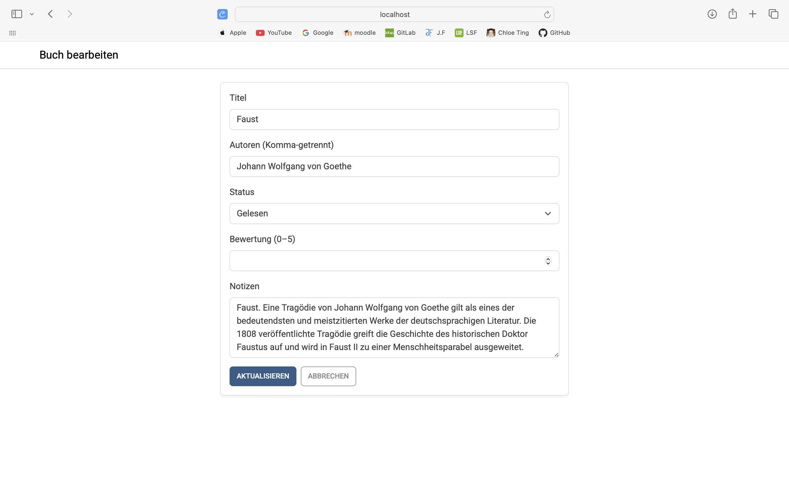

## 📚 BookFlow


## Inhaltsverzeichnis
1. [Was ist BookFlow](#-was-ist-bookflow)
2. [Installation](#-installation)
3. [Demo Flow mit Screenshots](#-demo-flow-mit-screenshots)
4. [Technologien](#-technologien)
6. [KI-Verzeichnis](#-ki-verzeichnis)

<br><br>

##  Was ist BookFlow
BookFlow ist eine Anwendung zur Verwaltung persönlicher Bücher.  
Du kannst dich registrieren und einloggen. 
Danach:  


-  Bücher hinzufügen, bearbeiten oder löschen  
-  Den Status festlegen (*Zu lesen*, *Lese*, *Gelesen*, *Abgebrochen*)  
-  Bücher bewerten und persönliche Notizen hinzufügen  


<br><br>


## Installation

### Voraussetzungen
- **Node.js** 
- **npm** (wird mit Node automatisch installiert)
- **Angular CLI** (`npm install -g @angular/cli`)
-  **MongoDB** 


<br><br>

##  Demo Flow mit Screenshots

### 1) Backend starten 
Wechsle ins Backend, installiere Abhängigkeiten und starte den Server.

```bash
cd backend
npm install
npm run dev 
```

Das Backend läuft auf: http://localhost:4000
<br><br>


 In backend/.env muss deine MongoDB-URL und ein JWT-Secret stehen:

```bash
MONGODB_URI= mongodb+srv://<user>:<pass>@cluster0.xxx.mongodb.net/bookflow 
JWT_SECRET=supersecret_change_me
PORT=4000
```


### 2) Frontend starten 
Wechsle ins Frontend, installiere Abhängigkeiten und starte den Server.

```
cd frontend
npm install
ng serve -o
``````

Die App öffnet sich unter: http://localhost:4200
<br><br>


### 3) Einloggen & Registrieren 




Willkommensseite: Hier kannst du dich einloggen. 

Falls noch kein Account besteht, registriere dich zu erst: 




Nach dem Anmelden gelangst du auf die Startseite. Wenn du dich zum ersten mal bei BookFlow anmeldest, ist deine Bücherliste leer: 




Hier kannst du dein erstes Buch anlegen. 





Nach und nach befüllt sich deine Buchliste 




Hier kannst du deinen Eintrag entweder bearbeiten oder löschen. 




<br><br>

##  Technologien


- **Frontend**
  - [Angular](https://angular.io/) 
  - [Bootstrap + Bootswatch](https://bootswatch.com/) – UI-Design & Styling
  

- **Backend**
  - [Node.js](https://nodejs.org/) 

- **Datenbank**
  - [MongoDB](https://www.mongodb.com/) 
  -  **MongoDB Compass** – grafisches Tool für die Datenbank

- **Sonstiges**
  - JWT (JSON Web Tokens) – für Authentifizierung
  - bcrypt – Passwort-Hashing


<br><br>

##  KI-Verzeichnis

Dieses Projekt wurde teilweise mit Unterstützung von OpenAI (ChatGBT) entwickelt.  
Die KI wurde vor allem eingesetzt, um:

- Fehler im Code schneller zu finden und zu beheben
- Zum erlernen der **MongoDB**
- Hilfe beim Aufbau der BAckend-Routen
- Hilfe bei der Datenbank Anbindung an das Bakend 
- Styling-Ideen mit **Bootswatch / Bootstrap** umzusetzen  
- Hilfestellung beim Schreiben der **README.md** zu bekommen  

Alle Entscheidungen über den Code, die Architektur und das Design wurden jedoch <u>eigenständig</u> getroffen.  
